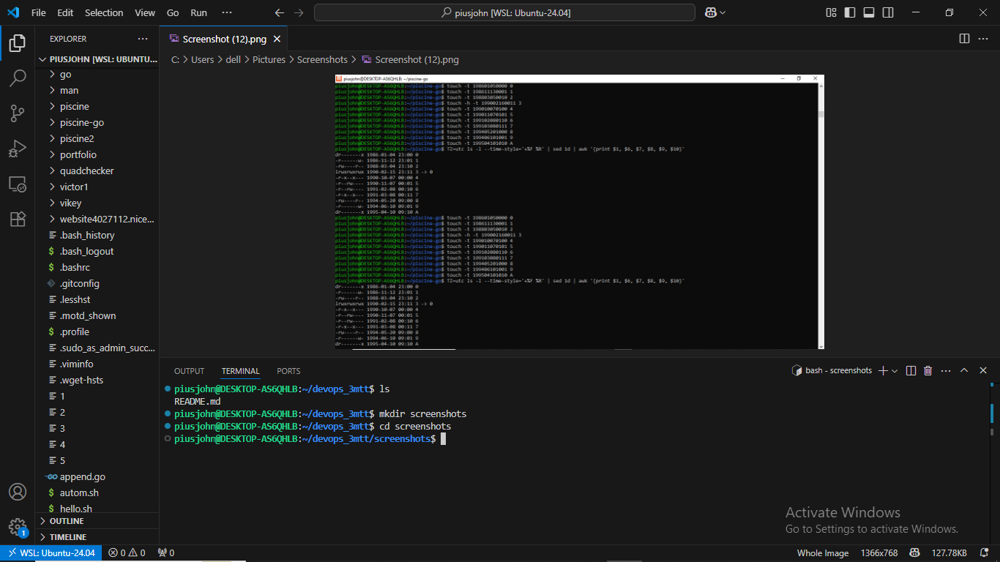
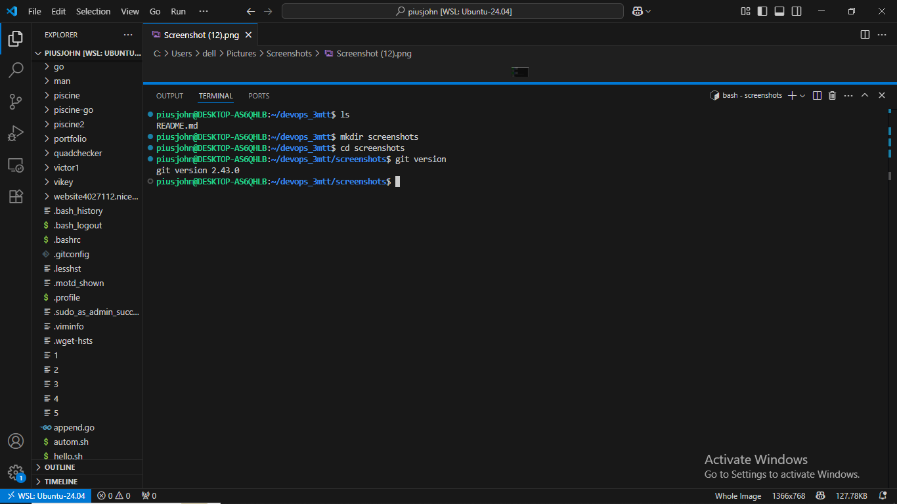
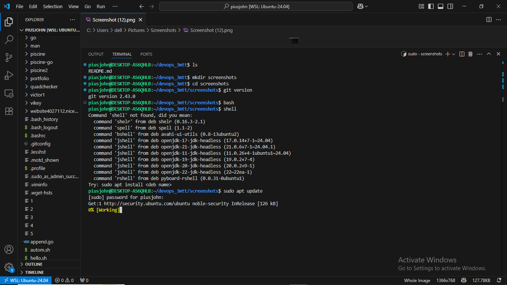
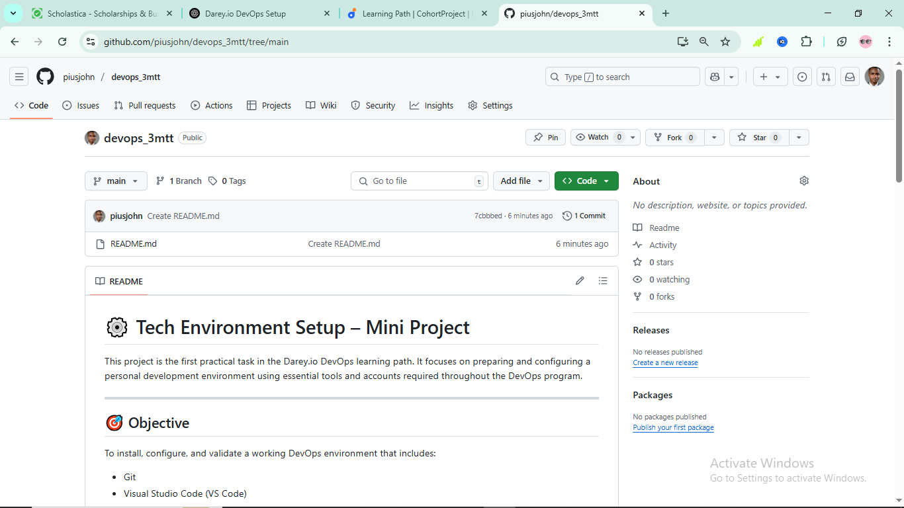

# ⚙️ Tech Environment Setup – Mini Project

This mini-project is the first hands-on task in the Darey.io DevOps learning path. The objective is to prepare a functional development environment using essential DevOps tools.

---

## 🎯 Objective

Set up and validate the following tools and services:
- Git
- Visual Studio Code (VS Code)
- Ubuntu/Linux (EC2 or local VM)
- GitHub account
- AWS EC2 instance

---

## 🧰 Tools Installed

| Tool            | Purpose                              |
|-----------------|--------------------------------------|
| **Git**         | Version control system               |
| **VS Code**     | Code editor for development          |
| **Ubuntu 20.04**| Development environment (EC2/Local)  |
| **GitHub**      | For source code management           |
| **AWS EC2**     | Remote server for Linux environment  |
| **SSH**         | Secure access to EC2 instance        |

---

## 🧪 Setup Steps

### ✅ Git Installation

```bash
sudo apt update
sudo apt install git -y
git --version

✅ VS Code Setup
Installed from: https://code.visualstudio.com
Extensions used: GitLens, Remote - SSH

✅ Ubuntu/Linux Setup
Created and connected to an Ubuntu 20.04 environment (AWS EC2)

✅ GitHub Setup
Configured Git locally and created a GitHub account for version control.

✅ AWS Setup
Created and launched an EC2 instance with Ubuntu 20.04 and connected via SSH.

📸 Screenshots

1. Visual Studio Code Installed


2. Git Installation Confirmation


3. Ubuntu/Linux Terminal (EC2 or Local)


4. GitHub Profile


5. AWS EC2 Console


✅ Outcome
All required tools are installed and configured.

Environment is fully ready for future DevOps projects.

Screenshots have been provided to validate each step.

✍️ Author
Pius John
Corporate Student – Darey.io PBL
GitHub: @piusjohn

📂 Folder Structure (for clarity)
devops_3mtt/
├── README.md
└── screenshots/
    ├── vscode.png
    ├── gitsetup.png
    ├── ubuntu.png
    ├── github.png
    └── aws.png
